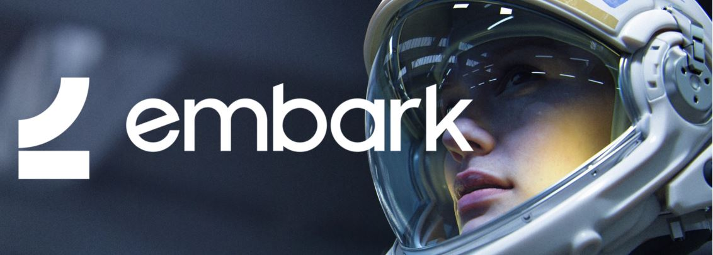

# Embark Rust Ecosystem

High-level tracking and discussions about improving Rust and the Rust ecosystem for our game development use cases at [Embark](http://embark.games).

Check out the __[Issues](https://github.com/EmbarkStudios/rust-ecosystem/issues)__ for active topics.

## Background

When we started Embark, we chose Rust as our primary language for the long term future we are building. We love the safety and robustness of the language, the ability to write high performance, safe, and (mostly) bug free code and then fearlessly refactor and change it without common lifetime/ownership, memory safety or race condition problems.

That, combined with the openness and collaborative nature of the quickly growing ecosystem of and around Rust with crates.io and the tens of thousands of open source crates with a best-in-class package system, [cargo](https://doc.rust-lang.org/cargo/), truly makes Rust [a language for the next 40 years](https://www.youtube.com/watch?v=A3AdN7U24iU).

We believe that by openly sharing our work, issues, and ideas with the community, we'll create more opportunities for collaboration and discussion to bring us toward a great future for Rust and for the games industry in general.

-- Johan Andersson ([`@repi`](http://twitter.com/repi)), CTO, Embark

## Open Source

Open source Rust projects we've created so far and are actively using and maintaining:

Name | Description | Crates.io
--- | --- | ---
🌋 [`ash-molten`](https://github.com/EmbarkStudios/ash-molten.git) | Statically linked MoltenVK for Vulkan on Mac using Ash | 
👷 [`buildkite-jobify`](https://github.com/EmbarkStudios/buildkite-jobify) | Kubekite, but in Rust, using configuration from your repos
📜 [`cargo-about`](https://github.com/EmbarkStudios/cargo-about) | Cargo plugin to generate list of all licenses for a crate | 
❌ [`cargo-deny`](https://github.com/EmbarkStudios/cargo-deny) | Cargo plugin to help you manage large dependency graphs | 
🎁 [`cargo-fetcher`](https://github.com/EmbarkStudios/cargo-fetcher) | `cargo fetch` alternative for use in CI or other "clean" environments | 
📦 [`krates`](https://github.com/EmbarkStudios/krates) | Creates graphs of crates from cargo metadata | 
🎳 [`physx`](https://github.com/EmbarkStudios/physx-rs) | Use [NVIDIA PhysX](https://github.com/NVIDIAGameWorks/PhysX) in Rust | 
🐏 [`rpmalloc-rs`](https://github.com/EmbarkStudios/rpmalloc-rs) | Cross-platform Rust global memory allocator using [rpmalloc](https://github.com/rampantpixels/rpmalloc) | 
🆔 [`spdx`](https://github.com/EmbarkStudios/spdx) | Helper crate for SPDX expressions | 
🔆 [`superluminal-perf`](https://github.com/EmbarkStudios/superluminal-perf-rs) | [Superluminal Performance](http://superluminal.eu) profiler integration | 
📂 [`tame-gcs`](https://github.com/EmbarkStudios/tame-gcs) | Google Cloud Storage functions that follows the sans-io approach | 
🔐 [`tame-oauth`](https://github.com/EmbarkStudios/tame-oauth) | Small OAuth crate that follows the sans-io approach | 
🎨 [`texture-synthesis`](https://github.com/EmbarkStudios/texture-synthesis) | Example-based texture synthesis generator and CLI example | 

You can see all these crates on our [crates.io profile](https://crates.io/users/embark-studios).

### Contributing

We encourage contributions to any of our open source projects. If you're not sure where to start, look at the GitHub issues on any of the above projects!

Check out [`guidelines.md`](guidelines.md) for our guidelines & policies for how we develop in Rust.

To make sure we keep a friendly and safe environment for everyone, we have a Contributor Code of Conduct. You can read this in any of our projects' repositories. By contributing to our projects, you agree to the code of conduct.

## Areas of Interest

Areas that we are interested in or working on, and want to help see improved in Rust:

* ☸ __[Distributed systems](https://areweasyncyet.rs/)__ - [async](https://rust-lang.github.io/async-book/), [tokio](https://tokio.rs/), [tonic](https://github.com/hyperium/tonic)

* 🕹️ __[Game engine systems](http://arewegameyet.com/)__ - multiplayer, rendering, physics, audio, server, assets, workflows

* 📦 __Developer experience__ - fast iteration with large projects/monorepos, distributed builds, debugging, profiling, IDE

* 🛸 __[WebAssembly](https://webassembly.org/) and [WASI](https://hacks.mozilla.org/2019/03/standardizing-wasi-a-webassembly-system-interface/)__ - sandboxed safe Rust code on client, edge & cloud

* 🤖 __[Machine learning](http://www.arewelearningyet.com/)__ - efficient inference, library bindings, training environments

* 🚀 __High performance runtime__ - CPU job scheduling, code generation, optimizing crates

* 📺📱 __Console & mobile platform support__ - PlayStation, Xbox, future hw. iOS & Android. [#18](https://github.com/EmbarkStudios/rust-ecosystem/issues/18)

* 🏎 __Rust on GPU__ - future compute & ML programming models beyond shaders

We track and discuss these from our perspective in the __[Issues](https://github.com/EmbarkStudios/rust-ecosystem/issues)__ for visibility and to get feedback, feel free to join in if you have ideas!

Also check out the [Rust Game Development Working Group](https://github.com/rust-gamedev/wg).

## Sponsorships

We believe that open source creators are integral to the success of the Rust ecosystem. We offer monetary sponsorship to several individuals and projects via Patreon, GitHub and OpenCollective. You can see who we're currently supporting below:

* Individual developers on [Patreon](https://www.patreon.com/embarkstudios/creators) and [GitHub Sponsors](https://github.com/embark-studios)

* [Amethyst](https://amethyst.rs/) and [rust-analyzer](https://github.com/rust-analyzer/rust-analyzer) on [OpenCollective](https://opencollective.com/embarkstudios)

## Work with us!

We're actively looking to collaborate with developers on the areas discussed in this repository. If you're interested in working on a specific issue or idea highlighted here, please reach out to us at [`opensource@embark-studios.com`](mailto:opensource@embark-studios.com) to discuss contracting opportunities or sponsorship.

We are also [hiring](https://embark.games/jobs/) for full-time positions in Stockholm!

Let's go! 🚀
